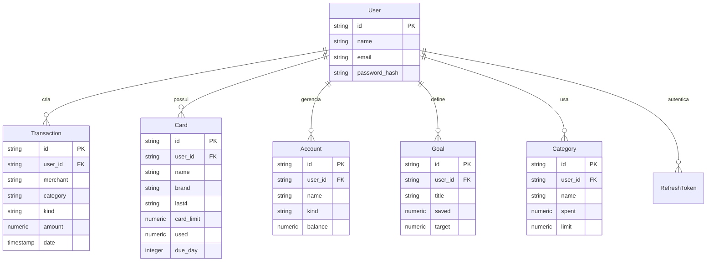

# Cifra - Documentação de Arquitetura

## Visão Geral

O Cifra é um aplicativo de controle financeiro pessoal que fornece uma interface limpa e intuitiva para o gerenciamento de finanças. Esta documentação descreve a arquitetura de backend implementada para suportar o frontend existente, garantindo compatibilidade, segurança e escalabilidade.

## Stack Tecnológica

A stack de backend foi escolhida com base na necessidade de um sistema performático, tipado e fácil de manter, além de ser altamente compatível com o ecossistema Node.js utilizado no frontend.

- **Linguagem**: TypeScript (garante tipagem forte e compatibilidade com o frontend).
- **Framework**: Express 4 (maduro, flexível e com vasto ecossistema).
- **Banco de Dados**: PostgreSQL 16 (robusto, relacional e ideal para dados financeiros).
- **ORM**: Drizzle ORM (leve, rápido e tipado, gerando SQL nativo).
- **Autenticação**: JWT (JSON Web Tokens) com refresh tokens seguros.
- **Validação**: Zod (validação de esquemas com boa experiência de desenvolvedor).
- **Testes**: Vitest (rápido, moderno e compatível com Vite) + Supertest.
- **Containerização**: Docker e Docker Compose.
- **CI/CD**: GitHub Actions.

## Estrutura de Diretórios

A arquitetura segue o padrão MVC (Model-View-Controller) com camadas bem definidas:

```text
src/backend/
├── src/
│   ├── config/        # Configurações de ambiente e logger
│   ├── controllers/   # Lógica de manipulação de requisições e respostas
│   ├── db/            # Conexão, schema e migrations do banco
│   ├── middleware/    # Autenticação, tratamento de erros e logs
│   ├── routes/        # Definição de rotas da API
│   ├── tests/         # Testes unitários, de integração e smoke tests
│   ├── types/         # Interfaces e tipos compartilhados
│   └── utils/         # Utilitários e classes de erro
├── .env.example       # Modelo de variáveis de ambiente
├── drizzle.config.ts  # Configuração do Drizzle ORM
├── Dockerfile         # Imagem multi-stage para produção
└── package.json       # Dependências e scripts
```

## Entidades e Relacionamentos

O modelo de dados é focado em atender todas as necessidades do frontend:



## Fluxo de Autenticação

O sistema utiliza um fluxo de autenticação baseado em JWT com dois tokens:

1. **Access Token**: Tem vida curta (15 minutos) e é enviado no header `Authorization: Bearer <token>` de todas as requisições protegidas.
2. **Refresh Token**: Tem vida longa (7 dias), é armazenado no banco de dados (com hash) e serve apenas para renovar o Access Token sem que o usuário precise fazer login novamente.

## Segurança

Foram aplicadas as melhores práticas de segurança (OWASP Top 10):

- **Senhas**: Armazenadas com hash bcrypt (cost 12).
- **Validação**: Todas as entradas são validadas com Zod para prevenir injeções.
- **Autorização**: Verificação de propriedade em nível de banco de dados (um usuário não pode acessar recursos de outro).
- **Rate Limiting**: Implementado via `express-rate-limit` para prevenir ataques de força bruta.
- **CORS**: Configurado de forma restritiva.
- **Cabeçalhos de Segurança**: Gerenciados pelo Helmet.

## Decisões Arquiteturais (ADRs)

### ADR 001: Escolha do ORM

**Decisão**: Utilizar Drizzle ORM em vez de Prisma ou TypeORM.
**Motivo**: O Drizzle possui uma sintaxe extremamente próxima do SQL nativo, é mais performático e gera tipos TypeScript automaticamente a partir do schema, o que é fundamental para a compatibilidade estrita com o frontend existente.

### ADR 002: Separação de Responsabilidades

**Decisão**: Utilizar Controllers para lidar com requisições HTTP e extrair a lógica para serviços/repositórios quando necessário, mantendo a lógica de negócios nos controllers por enquanto, dada a simplicidade atual do sistema.
**Motivo**: Evitar overengineering no início do projeto, mantendo a simplicidade sem sacrificar a organização.

## Operação e Manutenção

O sistema pode ser executado localmente via Docker Compose, que sobe o banco de dados PostgreSQL e executa as migrations automaticamente antes de iniciar o backend. O health check da aplicação pode ser consultado em `/health`.
